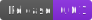
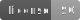

[webpage]: PROJECT_WEBPAGE_URL
[repository]: PROJECT_GITHUB_LINK
[issues]: PROJECT_GITHUB_LINK/issues
[releases]: PROJECT_GITHUB_LINK/releases

# PROJECT_TITLE

PROJECT_DESCRIPTION

[][releases]

## About the project

This is a blank template to get started. First replace following placeholders:

* PROJECT_TITLE
* PROJECT_DESCRIPTION
* PROJECT_GITHUB_LINK
* PROJECT_WEBPAGE_URL
* PROJECT_SONARCLOUD_NAME

Assets could be placed under `docs/src/assets/` folder and images should be placed in `docs/src/assets/images/`.

If you like to use badges, have a look at [badges how to](docs/develop/badges.md).

### Features

// this section is optional

- List of features

### Build With

// this section is optional

- link
- link
- link

## Getting Started

Instructions how to get software up and running.

### Prerequisites

List things you need to use the software and how to install them.

- npm
- Gradle

### Installation

A step by step series of examples that tell you how to get it running.

## Usage

Use this space to show useful examples of how a project can be used. Additional screenshots, code examples and demos work well in this space. You may also link to more resources.

## Roadmap

This project is work in progress. We are working on adding more functionality, guidelines,
documentation and other improvements.

Next planed features:

- feature description

See the open [issues] for a list of proposed improvements and known issues.

## Changelog

All notable changes to this project will be documented in the [changelog](CHANGELOG.md).

## Versioning

We use [Semantic Versioning](http://semver.org/) as a guideline for our versioning.

## Contributing

You want to help or share a proposal? You have a specific problem? [Report a bug][issues] or [request a feature][issues].

You want to fix or change code? Read the [Code of Conduct](CODE_OF_CONDUCT.md) and [contributing guide](CONTRIBUTING.md).

## Releasing

See [releasing](docs/develop/RELEASING.md).

## Copyright and license

Copyright (c) 2022 Wolf-Martell Montwé.

Please refer to the [ISC License](LICENSE.md) for more information.

## Acknowledgements

// this section is optional

- Hat tip to anyone whose code was used
- Inspiration
- etc
